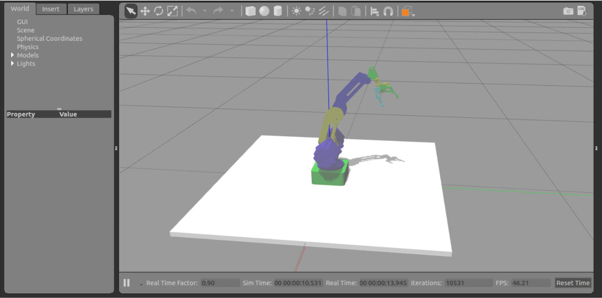

# dobot magician ROS package
For this project, we are going to simulate de Dobot Magician Robot in Gazebo with Moveit through ROS. Dobot Magician Robot is development for Shenzhen Yueliang Technology; is a company dedicated to development robot arm solution in China. Dobot is the first generation of robot arm debuted in 2015 in the worldwide.
The Dobot Magician manipulator has 4 degrees of freedom and the final effector has 2; That is, in 3D modeling of the robot it is necessary to generate 6 links with their respective dimensions in the archive urdf that describes the robot. 

What is intended is to model the robot using ROS to simulate the behavior of the same in a physical environment without having to get to build the real model of the robot. One objective of the project is to model the robot using CAD drawing software; For this case, SolidWorks 2016 will be used.

After the robot has been modeled, the necessary packages will be built in ROS to be able to interact with all the tools offered by this operating system, such as Gazebo and Moveit, two
essential programs in the development of this project. Also, it is intended to visualize the model of the robot in a virtual environment and verify each of the degrees of freedom of the robot.On the other hand, the physical measurements of the robot of each link for the modeling in SoliWorks were taken using a foot of king with 50 divisions in the vernier. 

Later the robot model is described using the Xacro format in XML and finally the step by step is detailed for loading and visualization of the model in Gazebo with Moveit

## Result

